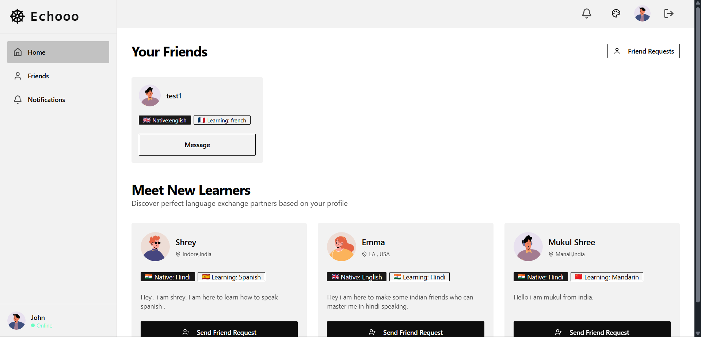

# 🌍 Echooo - Language Exchange Platform

### Connect. Learn. Communicate.

*A modern, full-stack platform designed to connect language learners worldwide through real-time chat and video calls.*

[](https://echooo-yhvl.onrender.com)


[](https://reactjs.org/)
[](https://vitejs.dev/)
[](https://tailwindcss.com/)

[](https://nodejs.org/)
[](https://www.mongodb.com/)
[](https://expressjs.com/)

[](https://getstream.io/)
[](https://render.com/)
[![License](https://img.shields.io/badge/License-MIT-blue?style=for-the-badge&logo=data:image/svg+xml;base64,PHN2ZyB4bWxucz0iaHR0cDovL3d3dy53My5vcmcvMjAwMC9zdmciIHZpZXdCb3g9IjAgMCAyNCAyNCI+PHBhdGggZmlsbD0iI2ZmZiIgZD0iTTEwLjA4IDEwLjg2Yy4wNS0uMzMuMTYtLjYyLjMtLjg3cy4zNC0uNDYuNTktLjYyYy4yNC0uMTUuNTQtLjIyLjkxLS4yMy4yMy4wMS40NC4wNS42My4xMy4yLjA5LjM4LjIuNTIuMzZzLjI1LjM0LjM0LjU1Yy4wOS4yMS4xMy40NC4xNC42OWgxLjc5Yy0uMDItLjQ3LS4xMS0uOS0uMjgtMS4yOXMtLjQtLjczLS43LTEuMDFzLS42Ni0uNS0xLjA4LS42NS0uODgtLjIzLTEuMzktLjIzYy0uNjUgMC0xLjIyLjExLTEuNy4zNHMtLjg4LjUzLTEuMi45Mi0uNTYuODQtLjcxIDEuMzZTOCA4LjY4IDggOS4zOXYxLjMyYzAgLjcxLjA5IDEuMzQuMjggMS44OHMuNDUgMSAuNzggMS4zNi43My42NSAxLjE3Ljg1IDEuMDMuMyAxLjYyLjNjLjUxIDAgLjk4LS4wNyAxLjM5LS4yMXMuNzctLjMzIDEuMDgtLjU3LjU2LS41MS43NC0uODIuMjktLjY2LjMxLTEuMDJoLTEuNzljLS4wMS4yMy0uMDYuNDQtLjE1LjYycy0uMi4zMy0uMzQuNDYtLjMyLjIzLS41Mi4zYy0uMTkuMDctLjM5LjA5LS42LjFjLS4zNi0uMDEtLjY2LS4wOC0uODktLjIzLS4yNS0uMTYtLjQ1LS4zNy0uNTktLjYycy0uMjUtLjU1LS4zLS44OC0uMDgtLjY3LS4wOC0xLjAydi0xLjMyYzAtLjM1LjAzLS42OC4wOC0xLjAxek0xMiAyQzYuNDggMiAyIDYuNDggMiAxMnM0LjQ4IDEwIDEwIDEwIDEwLTQuNDggMTAtMTBTMTcuNTIgMiAxMiAyem0wIDE4Yy00LjQxIDAtOC0zLjU5LTgtOHMzLjU5LTggOC04IDggMy41OSA4IDgtMy41OSA4LTggOHoiLz48L3N2Zz4=)](LICENSE)


---

## 📸 Screenshot



### 🚀 [**Try Live Demo**](https://echooo-yhvl.onrender.com)

---

## ✨ Features

### 🔐 **Authentication & User Management**
- Secure user registration and login with JWT authentication
- Personalized onboarding process for new users
- Profile customization with avatar support
- Session management with HTTP-only cookies

### 👥 **Smart Friend Matching**
- AI-powered recommendation system based on:
  - Native language preferences
  - Learning language goals
  - User location and interests
- Send and receive friend requests
- Real-time notification system
- Friend list management

### 💬 **Real-Time Chat** *(Powered by Stream Chat)*
- Instant messaging with friends
- Message history and persistence
- Typing indicators
- Online/offline status
- Rich media support

### 🎥 **HD Video Calls** *(Powered by Stream Video)*
- Crystal-clear video and audio communication
- Screen sharing capabilities
- Speaker layout optimization
- Call controls (mute, camera toggle, end call)
- Multi-participant support

### 🎨 **Modern UI/UX**
- Multiple theme options (light/dark mode)
- Responsive design for all devices
- Smooth animations and transitions
- Intuitive navigation
- Accessible components

### 🌐 **Language Support**
- Visual language flags and indicators
- Multiple language pair combinations
- Native and learning language badges

---

## 🛠️ Tech Stack


### 💻 Frontend Development


### ⚡ Real-Time Communication


### 🔧 Backend Development


### ☁️ DevOps & Cloud Services


---

## 📁 Project Structure

```
Echooo-chat_App/
├── Backend/
│   ├── src/
│   │   ├── controllers/      # Business logic
│   │   │   ├── authController.js
│   │   │   ├── chatController.js
│   │   │   └── userController.js
│   │   ├── lib/              # Utility functions
│   │   │   ├── db.js
│   │   │   └── stream.js
│   │   ├── middlewares/      # Custom middleware
│   │   │   └── authMiddleware.js
│   │   ├── models/           # Database models
│   │   │   ├── User.js
│   │   │   └── FriendRequest.js
│   │   ├── routes/           # API routes
│   │   │   ├── authRoute.js
│   │   │   ├── chatRoute.js
│   │   │   └── userRoute.js
│   │   └── server.js         # App entry point
│   └── package.json
│
├── Frontend/
│   ├── src/
│   │   ├── components/       # Reusable components
│   │   │   ├── FriendCard.jsx
│   │   │   ├── Layout.jsx
│   │   │   ├── Navbar.jsx
│   │   │   ├── Sidebar.jsx
│   │   │   └── ...
│   │   ├── pages/            # Page components
│   │   │   ├── HomePage.jsx
│   │   │   ├── ChatPage.jsx
│   │   │   ├── CallPage.jsx
│   │   │   ├── LoginPage.jsx
│   │   │   ├── SignUpPage.jsx
│   │   │   ├── NotificationPage.jsx
│   │   │   └── OnboardingPage.jsx
│   │   ├── hooks/            # Custom React hooks
│   │   ├── lib/              # API utilities
│   │   ├── store/            # State management
│   │   └── App.jsx           # Root component
│   └── package.json
│
└── README.md
```

---

## 🚀 Getting Started

### Prerequisites

- **Node.js** (v16 or higher)
- **npm** or **yarn**
- **MongoDB** (local or Atlas)
- **Stream Account** (for chat and video features)

### Installation

1. **Clone the repository**
   ```bash
   git clone https://github.com/kartik-hub-enjay/Echooo-A-Language-Exchange-Platform.git
   cd Echooo-A-Language-Exchange-Platform
   ```

2. **Install dependencies**
   ```bash
   # Install root dependencies
   npm install

   # Install backend dependencies
   cd Backend
   npm install

   # Install frontend dependencies
   cd ../Frontend
   npm install
   ```

3. **Set up environment variables**

   **Backend** (`Backend/.env`):
   ```env
   PORT=3000
   MONGO_URI=your_mongodb_connection_string
   JWT_SECRET_KEY=your_jwt_secret
   STREAM_API_KEY=your_stream_api_key
   STREAM_API_SECRET=your_stream_api_secret
   NODE_ENV=development
   ```

   **Frontend** (`Frontend/.env`):
   ```env
   VITE_STREAM_API_KEY=your_stream_api_key
   ```

4. **Run the application**

   ```bash
   # From root directory
   # Development mode
   npm run dev

   # OR run separately:
   
   # Backend (from Backend directory)
   npm run dev
   
   # Frontend (from Frontend directory)
   npm run dev
   ```

5. **Open your browser**
   - Frontend: http://localhost:5173
   - Backend API: http://localhost:3000

---

## 🌐 Deployment

### Build for Production

```bash
# Build frontend
cd Frontend
npm run build

# The built files will be in Frontend/dist
```

### Deploy to Render

1. Push your code to GitHub
2. Connect your repository to Render
3. Configure build settings:
   - **Build Command**: `npm run build`
   - **Start Command**: `npm start`
4. Add environment variables in Render dashboard
5. Deploy!

---

## 🔑 Key Features Explained

### **Friend Recommendation Algorithm**
The platform uses an intelligent matching system that analyzes:
- User's native language
- Language they're learning
- Mutual interests and compatibility
- Excludes existing friends
- Only shows fully onboarded users

### **Real-Time Communication**
Powered by Stream's infrastructure:
- **Chat**: Persistent, scalable messaging
- **Video**: Low-latency HD video calls
- **Notifications**: Instant updates on friend requests and messages

### **Security**
- JWT-based authentication
- HTTP-only cookies prevent XSS attacks
- bcrypt password hashing
- Protected API routes
- CORS configuration

---

## 📱 API Endpoints

### Authentication
- `POST /api/auth/signup` - Register new user
- `POST /api/auth/login` - User login
- `POST /api/auth/logout` - User logout
- `GET /api/auth/me` - Get current user
- `POST /api/auth/onboarding` - Complete onboarding

### Users
- `GET /api/users` - Get recommended users
- `GET /api/users/friends` - Get user's friends
- `POST /api/users/friend-request/:id` - Send friend request
- `PUT /api/users/friend-request/:id/accept` - Accept friend request
- `GET /api/users/friend-requests` - Get pending requests
- `GET /api/users/outgoing-friend-requests` - Get sent requests

### Chat
- `GET /api/chat/token` - Get Stream chat token

---

## 🤝 Contributing

Contributions are welcome! Please feel free to submit a Pull Request.

1. Fork the project
2. Create your feature branch (`git checkout -b feature/AmazingFeature`)
3. Commit your changes (`git commit -m 'Add some AmazingFeature'`)
4. Push to the branch (`git push origin feature/AmazingFeature`)
5. Open a Pull Request

---


---

## 👨‍💻 Author

**Kartik Pareek**

- GitHub: [@kartik-hub-enjay](https://github.com/kartik-hub-enjay)
- Repository: [Echooo-A-Language-Exchange-Platform](https://github.com/kartik-hub-enjay/Echooo-A-Language-Exchange-Platform)

---


---


### ⭐ If you find this project useful, please consider giving it a star!

**[Live Demo](https://echooo-yhvl.onrender.com)** • **[Report Bug](https://github.com/kartik-hub-enjay/Echooo-A-Language-Exchange-Platform/issues)** • **[Request Feature](https://github.com/kartik-hub-enjay/Echooo-A-Language-Exchange-Platform/issues)**

Made with ❤️ for language learners worldwide


